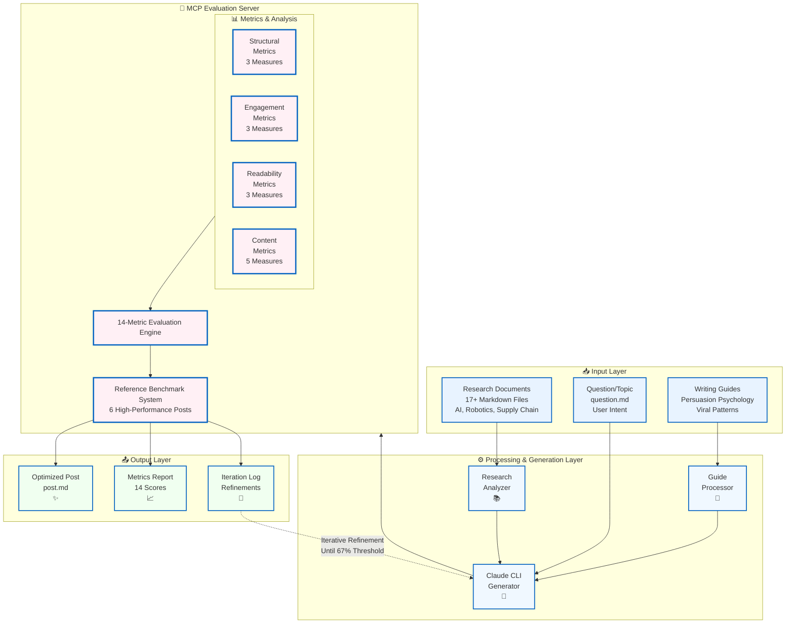

```mermaid
graph TD
    %% Input Sources - Top Layer
    subgraph InputLayer["📥 Input Layer"]
        direction LR
        A1[Research Documents<br/>17+ Markdown Files<br/>AI, Robotics, Supply Chain]
        A2[Question/Topic<br/>question.md<br/>User Intent]
        A3[Writing Guides<br/>Persuasion Psychology<br/>Viral Patterns]
    end
    
    %% Processing Layer - Second Layer
    subgraph ProcessingLayer["⚙️ Processing & Generation Layer"]
        direction LR
        B1[Research<br/>Analyzer<br/>📚]
        B2[Claude CLI<br/>Generator<br/>🤖]
        B3[Guide<br/>Processor<br/>📝]
    end
    
    %% MCP Evaluation Server - Central Component
    subgraph MCPServer["🔧 MCP Evaluation Server"]
        direction TB
        
        subgraph MetricsAnalysis["📊 Metrics & Analysis"]
            direction LR
            E1[Structural<br/>Metrics<br/>3 Measures]
            E2[Engagement<br/>Metrics<br/>3 Measures]
            E3[Readability<br/>Metrics<br/>3 Measures]
            E4[Content<br/>Metrics<br/>5 Measures]
        end
        
        C1[14-Metric Evaluation Engine]
        C2[Reference Benchmark System<br/>6 High-Performance Posts]
        
        MetricsAnalysis --> C1
        C1 --> C2
    end
    
    %% Output Layer
    subgraph OutputLayer["📤 Output Layer"]
        direction LR
        F1[Optimized Post<br/>post.md<br/>✨]
        F2[Metrics Report<br/>14 Scores<br/>📈]
        F3[Iteration Log<br/>Refinements<br/>🔄]
    end
    
    %% Connections - Symmetrical Flow
    A1 --> B1
    A2 --> B2
    A3 --> B3
    
    B1 --> B2
    B3 --> B2
    B2 --> MCPServer
    
    C2 --> F1
    C2 --> F2
    C2 --> F3
    
    %% Feedback Loop
    F3 -.->|"Iterative Refinement<br/>Until 67% Threshold"| B2
    
    %% Styling
    classDef inputStyle fill:#E8F3FF,stroke:#0A66C2,stroke-width:2px
    classDef processStyle fill:#F0F8FF,stroke:#0A66C2,stroke-width:2px
    classDef mcpStyle fill:#FFF0F5,stroke:#0A66C2,stroke-width:3px
    classDef outputStyle fill:#F0FFF0,stroke:#0A66C2,stroke-width:2px
    classDef feedbackStyle stroke:#FF6B35,stroke-width:2px,stroke-dasharray: 5 5
    
    class A1,A2,A3 inputStyle
    class B1,B2,B3 processStyle
    class C1,C2,E1,E2,E3,E4 mcpStyle
    class F1,F2,F3 outputStyle
```
